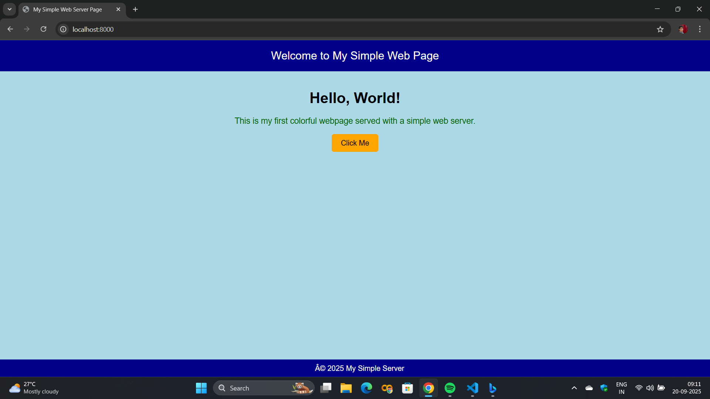
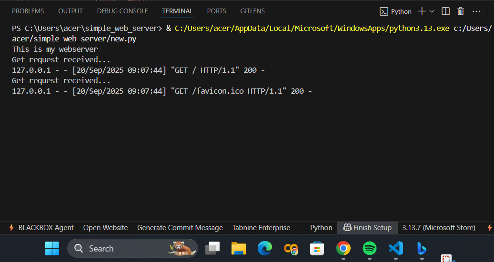

# EX01 Developing a Simple Webserver

# Date:20-09-2025
# AIM:
To develop a simple webserver to serve html pages and display the configuration details of laptop.

# DESIGN STEPS:
## Step 1:
HTML content creation.

## Step 2:
Design of webserver workflow.

## Step 3:
Implementation using Python code.

## Step 4:
Serving the HTML pages.

## Step 5:
Testing the webserver.

# PROGRAM:
```
from django.shortcuts import render
from http.server import HTTPServer,BaseHTTPRequestHandler 
content = '''
from django.shortcuts import render
from http.server import HTTPServer,BaseHTTPRequestHandler 
content = '''<!DOCTYPE html>
<html>
<head>
    <title>My Simple Web Server Page</title>
    <style>
        body {
            background-color: lightblue;
            font-family: Arial, sans-serif;
            text-align: center;
            margin: 0;
            padding: 0;
        }
        header {
            background-color: darkblue;
            color: white;
            padding: 20px;
            font-size: 24px;
        }
        main {
            margin-top: 40px;
        }
        p {
            font-size: 18px;
            color: darkgreen;
        }
        button {
            background-color: orange;
            border: none;
            padding: 10px 20px;
            font-size: 16px;
            border-radius: 5px;
            cursor: pointer;
        }
        button:hover {
            background-color: red;
            color: white;
        }
        
    </style>
</head>
<body>
    <header>
         Welcome to My Simple Web Page 
    </header>

    <main>
        <h1>Hello, World!</h1>
        <p>This is my first colorful webpage served with a simple web server.</p>
        <button onclick="alert('You clicked me!')">Click Me</button>
    </main>

    
</body>
</html>
'''

class MyServer(BaseHTTPRequestHandler):
    def do_GET(self): 
        print("Get request received..." )
        self.send_response(200) 
        self.send_header("content-type", "text/html") 
        self.end_headers() 
        self.wfile.write(content.encode())
print("This is my webserver") 
server_address =('', 8000) 
httpd = HTTPServer(server_address,MyServer) 
httpd.serve_forever()
```
# OUTPUT:



# RESULT:
The program for implementing simple webserver is executed successfully.
